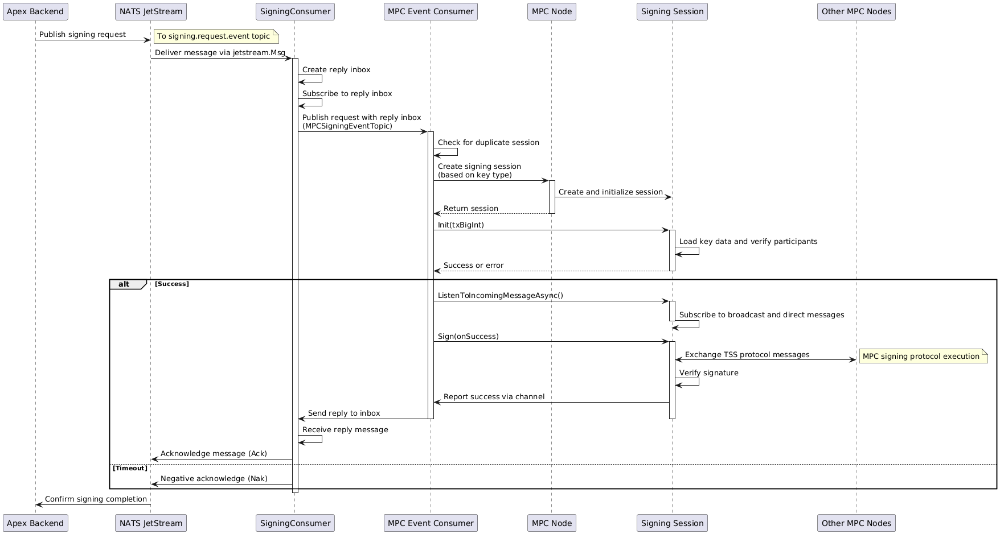

# Mpcium - Threshold Signature Scheme nodes by Fystack

This project employs multiple MPC nodes (Multi-Party Computation) to implement a secure and distributed threshold signature scheme. It aims to generate cryptographic signatures by distributing the private key among several nodes, requiring collaboration from a threshold number of nodes to produce a signature.

## Motivation

By distributing the private key among multiple nodes and requiring collaboration for signature generation, the project aims to enhance security, resilience, and trust in crypto currency wallet operations.

- **Enhanced Security**: With no single point of compromise.
- **Reduced Trust Requirements**: Trust is distributed among multiple nodes, reducing the reliance on a single trusted party.
- **Resilience to Node Failures**: Even if some nodes in the MPC network fail or become compromised, the threshold mechanism ensures that the system can still function as long as the specified threshold of nodes remains operational.
- **Privacy Preservation**: The collaborative nature of threshold signature generation helps preserve the privacy of the individual nodes, as no single node possesses the complete key

## Architecture

```
┌─────────────────────────────────────────────────────────────────────────────────────┐
│                                    MPC Node                                         │
└─────────────────────────────────────────────────────────────────────────────────────┘
                   │                  │                  │                  │
                   ▼                  ▼                  ▼                  ▼
┌─────────────┐ ┌────────────┐ ┌─────────────┐ ┌────────────────┐ ┌─────────────────┐
│Configuration│ │ Peer       │ │ Key/Signing │ │ Event          │ │ Messaging       │
│             │ │ Management │ │ Session     │ │ Consumers      │ │ Infrastructure  │
└─────────────┘ └────────────┘ └─────────────┘ └────────────────┘ └─────────────────┘
      │               │              │                │                   │
      ▼               ▼              ▼                ▼                   ▼
┌─────────────┐ ┌────────────┐ ┌─────────────┐ ┌────────────────┐ ┌─────────────────┐
│Config Files │ │PeerRegistry│ │KeyGen       │ │Signing Consumer│ │NATS/JetStream   │
│& Env Vars   │ │            │ │Signing      │ │Event Consumer  │ │Direct Messaging │
└─────────────┘ └────────────┘ └─────────────┘ │Timeout Consumer│ │PubSub           │
                       │              │        └────────────────┘ └─────────────────┘
                       │              │                │                   │
                       ▼              ▼                ▼                   ▼
                 ┌────────────┐ ┌───────────────────────────────────────────────────┐
                 │ Consul KV  │ │                Storage Layer                      │
                 │            │ │                                                   │
                 └────────────┘ │   ┌───────────┐             ┌────────────────┐    │
                                │   │ BadgerDB  │             │ Consul KV      │    │
                                │   │(Local KV) │             │(Distributed KV)│    │
                                │   └───────────┘             └────────────────┘    │
                                └───────────────────────────────────────────────────┘
```

## Features

- Threshold Signature Generation: The project allows multiple MPC nodes to collectively generate a threshold signature.
- Threshold Signing: Each transaction require a threshold number of shares to be combined to generate a final signature

## Get started

### Development

```shell
$ go run cmd/generate-id/main.go
```

Start 3 nodes

```shell
$ go run cmd/main.go --name=mpcium0
$ go run cmd/main.go --name=mpcium1
$ go run cmd/main.go --name=mpcium2

```

### Diagaram



## Encrypt

gpg --output quax.yaml.gpg --encrypt --recipient "63807133B8591D1F782B17DFDFBE205CE2069FE2" quax.yaml
